# AI增长操作系统领导评审文档

> 面向对象：公司管理层 / 产品决策会  
> 汇报目的：明确 AI 增长操作系统的产品边界、差异化定位、验证路径、阶段计划和资源需求。  
> 文档性质：领导评审版，不是详细 PRD。

---

## 1. 核心结论

AI增长操作系统不是再做一个“客户洞察名单系统”，而是要做一套 **把客户经营经验转成可运行、可验证、可复用规则的系统**。

它基于云帐房已有的客户数据、票财税数据、服务过程数据、企业微信 / 云微沟通数据和外部企业信息，让代账机构可以完成以下闭环：

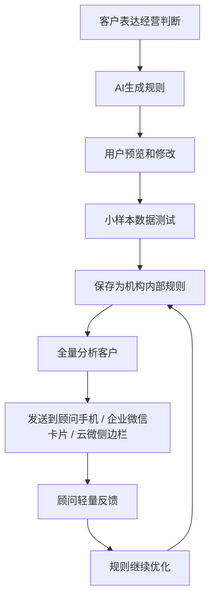

一句话概括：

> AI增长操作系统的价值不是一次性提供名单，而是把“经营经验”变成“可持续运行的规则资产”。

---

## 2. 与天工 / 洞察系统的本质区别

如果只是用固定规则筛选客户并输出名单，本质仍然属于洞察系统，难以形成足够差异化。

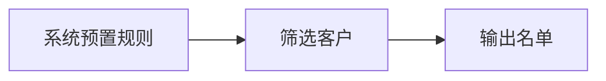

AI增长操作系统的核心区别在于：

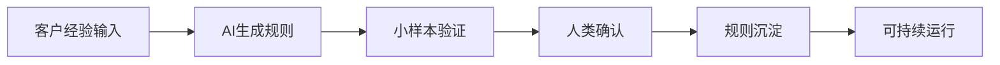

对比：

| 维度 | 洞察 / 名单系统 | AI增长操作系统 |
|---|---|---|
| 起点 | 系统预置规则 | 客户经营经验表达 |
| 核心能力 | 数据筛选 | 规则生成、验证与沉淀 |
| 用户参与 | 查看系统结果 | 共创、校验和确认规则 |
| 输出 | 客户名单 | 规则 + 可解释名单 + 行动建议 |
| 长期价值 | 单次洞察 | 可复用规则资产 |

固定规则仍然有价值，但它的定位应是基础验证能力，主要用于：

- 验证数据是否可用；
- 验证规则结果是否可解释；
- 作为现场规则共创的模板种子。

---

## 3. 产品最终形态：四层闭环

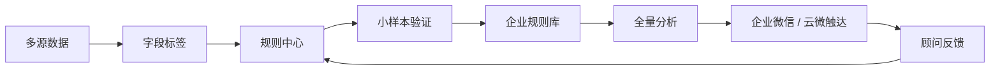

系统沉淀两类规则：

| 类型 | 说明 |
|---|---|
| 通用规则 | 可复制到多家机构的标准规则 |
| 企业规则 | 单一机构自身经营经验沉淀形成的规则 |

---

## 4. 为什么要做这件事

AI服务类能力解决的是“效率”问题，但不能直接解决“增长”问题。本系统解决的是：

> 顾问节省出来的时间，如何进一步转化为客户经营动作。

四个核心问题：

| 问题 | 系统能力 |
|---|---|
| 不知道谁值得关注 | 通过规则从存量客户中筛选目标企业 |
| 不知道为什么推荐 | 给出命中依据、数据解释和聊天线索 |
| 不知道怎么沟通 | 生成可复制、可修改的话术 |
| 经验无法沉淀 | 将经营判断沉淀为企业内部规则 |

---

## 5. 产品边界

第一阶段聚焦三个核心对象：

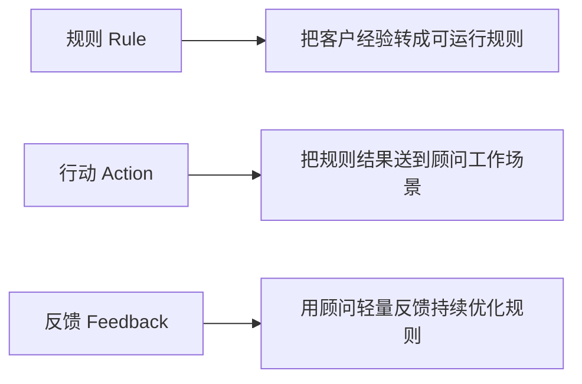

第一阶段不建设重型 CRM 流程，不包装成交数据，不以导出名单作为核心卖点。

---

## 6. 规则中心：统一入口

规则中心是 AI增长操作系统的核心操作入口，承担规则创建、规则验证、规则保存和全量分析能力。

规则中心包含五类能力：

- AI对话生成规则；
- 系统推荐模板；
- 企业内部规则；
- 小样本数据测试；
- 全量分析入口。

建议页面结构：

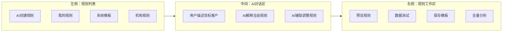

系统模板用于启发和快速开始。用户如需修改系统模板，应先保存为自己的规则副本，再进行编辑和运行。

---

## 7. 小样本验证：核心验证机制

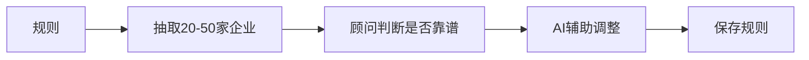

小样本验证的目标不是给客户看一批名单，而是验证规则质量。

验证维度：

- 是否能命中目标企业；
- 命中依据是否可解释；
- 是否符合顾问和客户的业务经验；
- 反馈后是否能够调整为更准确的规则。

顾问反馈应保持轻量：

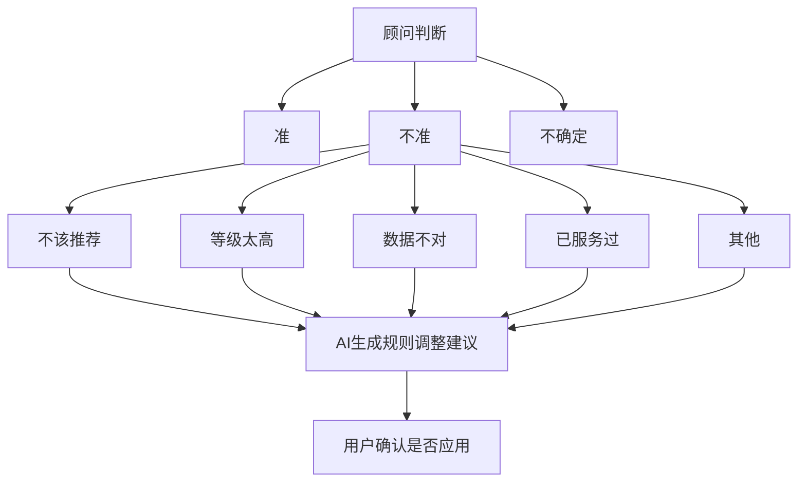

AI根据这些轻量反馈生成规则调整建议，由用户确认是否应用。

---

## 8. 全量分析：输出形态

保存后的规则可以手动触发全量分析，输出企业结果列表。

结果列表建议采用结构化表格，而不是卡片流或洞察报告：

| 企业 | 推荐等级 | 分数 | 原因 | 顾问 | 操作 |
|---|---|---|---|---|---|

操作保持轻量：

- 查看详情；
- 发送到手机；
- 打开云微侧边栏场景。

企业详情展示：

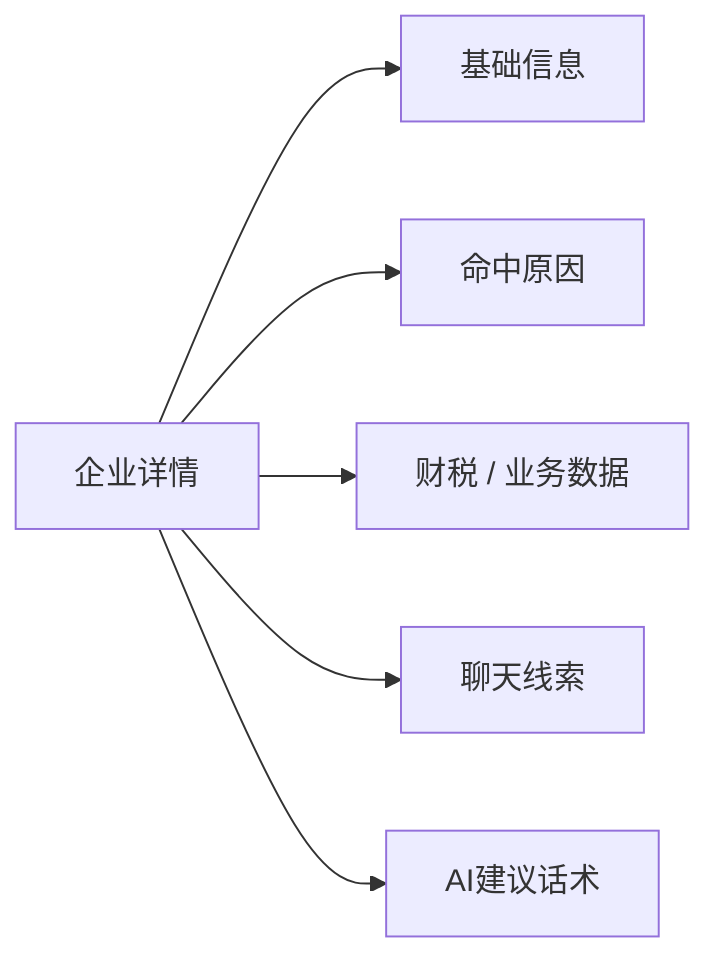

---

## 9. 企业微信与云微触达

### 9.1 企业微信手机端

企业微信消息只作为行动入口，不承载全部信息。

建议形式：

> 今日建议查看 6 家企业；共 11 条建议；2 家高推荐；点击打开小程序查看。

进入小程序后，用“企业列表 + 单企业展开”的结构：

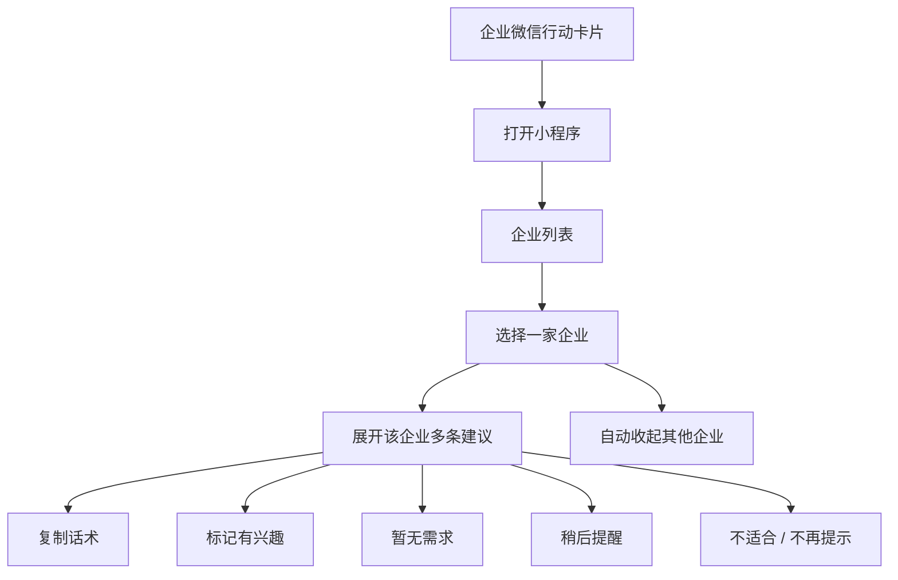

### 9.2 云微侧边栏

云微侧边栏对应电脑端企业微信对话场景。

页面形态：

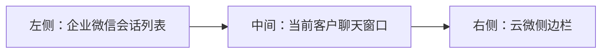

侧边栏只围绕当前客户提供辅助：

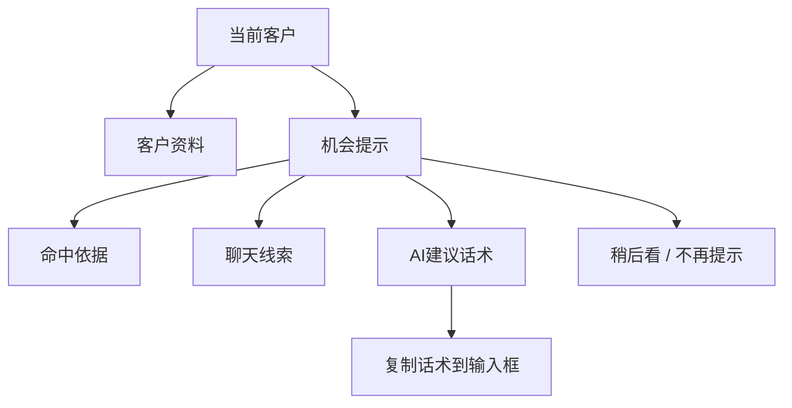

---

## 10. 规则质量反馈

第一阶段不使用成交指标，而是关注规则本身是否变准。

规则质量反馈关系：

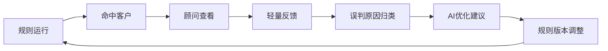

建议指标：

| 指标 | 含义 |
|---|---|
| 运行次数 | 规则被执行了多少次 |
| 命中客户数 | 每次运行命中的客户规模 |
| 查看率 | 发送到手机或侧边栏后是否被打开 |
| 正向反馈率 | 顾问标记“有兴趣”的比例 |
| 不适合比例 | 顾问标记“不适合”的比例 |
| 误判原因 | 顾问反馈中反复出现的问题 |
| AI优化建议 | AI建议如何调整规则 |

---

## 11. MVP策略

MVP建议采用双路径验证：

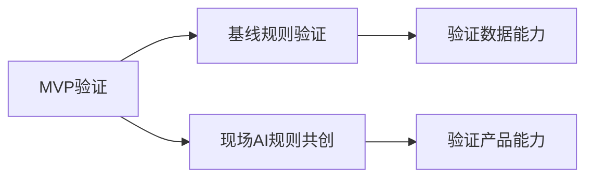

### 11.1 基线规则验证

候选基线规则：

- 高新申报客户；
- 涨价沟通客户；
- 广告投放客户；
- 工商变更客户；
- 贷款潜力客户。

基线验证目标：

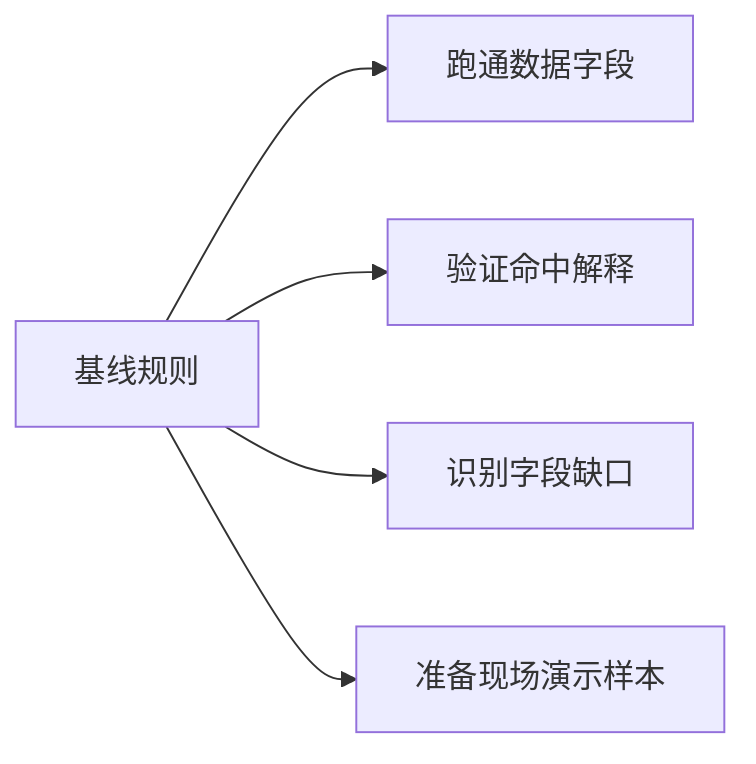

### 11.2 现场AI规则共创

核心路径：

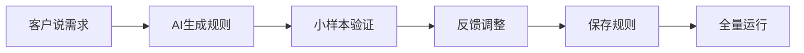

现场验证重点：

- 客户是否能用自然语言表达目标客户；
- AI是否能生成可理解规则；
- 小样本测试是否能帮助客户判断规则质量；
- 规则是否能保存为机构内部规则；
- 结果是否能进入顾问实际工作流。

---

## 12. 贷款公司验证案例

贷款公司验证的重点不是简单筛选贷款客户，而是验证“业务经验结构化能力”。

验证流程：

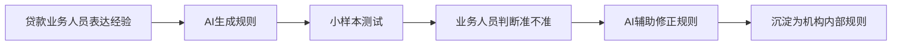

示例需求：

- 帮我找近期可能有资金需求的企业。
- 帮我找开票增长但现金流压力可能比较大的企业。
- 帮我找有扩张迹象、可能需要贷款的企业。

验证重点：

> AI能否把贷款公司的业务经验转成规则，并跑到我们的客户数据上。

---

## 13. 阶段计划

阶段推进关系：

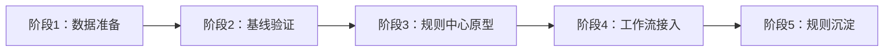

各阶段重点：

```mermaid
flowchart TD
    A["阶段1：数据准备"] --> A1["梳理字段体系"]
    A --> A2["梳理标签体系"]
    A --> A3["分析企业微信 / 云微聊天数据"]
    A --> A4["确认第一批规则所需数据"]

    B["阶段2：基线验证"] --> B1["选择3-5条基线规则"]
    B --> B2["跑出小样本结果"]
    B --> B3["查看命中解释"]
    B --> B4["识别数据缺口和误判原因"]

    C["阶段3：规则中心原型"] --> C1["AI生成规则"]
    C --> C2["规则预览和编辑"]
    C --> C3["小样本验证"]
    C --> C4["保存规则"]
    C --> C5["手动触发全量分析"]

    D["阶段4：工作流接入"] --> D1["企业微信卡片"]
    D --> D2["手机小程序企业列表"]
    D --> D3["云微侧边栏"]
    D --> D4["AI话术复制"]
    D --> D5["顾问轻量反馈"]

    E["阶段5：规则沉淀"] --> E1["通用规则库"]
    E --> E2["企业规则库"]
    E --> E3["规则质量反馈"]
    E --> E4["AI规则优化建议"]
```

---

## 14. 最终判断标准

第一阶段验证成功的标准不是是否导出了一批名单，也不是是否形成成交数据，而是：

> 是否可以把“客户经验”稳定转成“可执行规则”，并进入顾问日常工作动作。

具体判断：

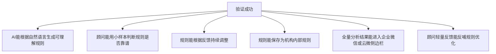
