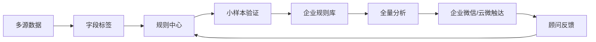

# AI增长操作系统领导评审文档

> 面向对象：公司管理层 / 产品决策会  
> 汇报目的：明确 AI 增长操作系统的产品边界、差异化定位、验证路径、阶段计划和资源需求。  
> 文档性质：领导评审版，不是详细 PRD。

---

## 1. 核心结论

AI增长操作系统不是再做一个“客户洞察名单系统”，而是要做一套 **把客户经营经验转成可运行、可验证、可复用规则的系统**。

它基于云帐房已有的客户数据、票财税数据、服务过程数据、企业微信/云微沟通数据和外部企业信息，让代账机构可以完成以下闭环：

```text
客户说出经营判断
  ↓
AI生成规则
  ↓
用户预览和修改
  ↓
小样本数据测试
  ↓
保存为机构内部规则
  ↓
全量分析客户
  ↓
发送到顾问手机 / 企业微信卡片 / 云微侧边栏
  ↓
顾问轻量反馈
  ↓
规则继续优化
```

一句话：

> 我们不是提供名单，而是把“经营经验”变成“可执行规则系统”。

---

## 2. 与天工/洞察系统的本质区别

如果只是用固定规则跑名单，这件事本质仍然是“洞察系统”，差异不成立。

```text
系统规则 → 筛选客户 → 输出名单
```

AI增长操作系统的核心区别在于：

```text
客户经验输入
→ AI生成规则
→ 小样本验证
→ 人类确认
→ 规则沉淀
→ 可持续运行
```

对比：

| 维度 | 洞察/名单系统 | AI增长操作系统 |
|---|---|---|
| 起点 | 系统预置规则 | 客户经验表达 |
| 核心能力 | 数据筛选 | 规则生成+验证+沉淀 |
| 用户参与 | 被动查看 | 主动共创 |
| 输出 | 名单 | 规则 + 名单 + 行动建议 |
| 长期价值 | 一次性使用 | 可复用规则资产 |

### 固定规则的定位（重要）

固定规则不是产品核心，只承担三件事：

- 验证数据是否可用
- 验证规则是否可解释
- 作为现场共创的模板种子

---

## 3. 产品最终形态（四层闭环）



系统沉淀两类规则：

| 类型 | 说明 |
|---|---|
| 通用规则 | 可复制到多客户的标准规则 |
| 企业规则 | 单一机构的经验沉淀 |

---

## 4. 为什么要做这件事

AI服务类能力解决“效率”，但不能解决“增长”。本系统解决的是：

> 顾问节省出来的时间，如何变成客户经营动作。

四个核心问题：

| 问题 | 系统能力 |
|---|---|
| 不知道谁值得跟 | 规则筛选 |
| 不知道为什么推荐 | AI解释 |
| 不知道怎么说 | 话术生成 |
| 经验无法沉淀 | 规则化 |

---

## 5. 产品关键调整（非常重要）

### 5.1 不再做“名单系统”叙事

不再强调：

- 导出名单
- 成交统计
- 转销售流程
- CRM闭环

### 5.2 改为三大核心对象

1. 规则（Rule）
2. 行动（Action）
3. 反馈（Feedback）

---

## 6. 规则中心（统一入口）

原来的“AI规则助手 + 模板中心”合并为：

> 规则中心

结构：

- AI对话生成规则
- 系统模板
- 企业规则
- 小样本验证
- 全量分析入口

---

## 7. 小样本验证（核心验证机制）

```text
规则 → 20-50企业 → 判断是否靠谱 → 调整 → 保存
```

验证维度：

- 是否能命中
- 是否可解释
- 是否符合业务经验

不是给客户“看名单”，而是验证规则质量。

---

## 8. 全量分析（输出形态）

输出必须是结构化列表，而不是洞察报告：

| 企业 | 推荐等级 | 分数 | 原因 | 顾问 | 操作 |
|---|---|---|---|---|---|

操作：

- 查看详情
- 发送到手机

❌ 不包含：
- 成交
- 跟进
- CRM流程

---

## 9. 企业微信 & 云微触达

### 企业微信

- 只发“行动卡片”
- 一个企业可能多个建议

### 云微侧边栏

- 当前客户 + 当前建议
- 话术 + 数据依据
- 一键复制

---

## 10. 规则质量反馈（替代“效果看板”）

不再使用成交指标。

关注：

- 规则是否被使用
- 顾问是否采纳
- 是否误判
- 是否需要调整

---

## 11. MVP策略（关键变化）

### 双路径验证

```text
A：基线规则验证（数据能力）
B：现场AI规则共创（产品能力）
```

### 基线规则（降级为工具）

- 高新客户
- 涨价客户
- 广告客户
- 工商变更
- 贷款潜力

作用：验证数据，不是产品卖点。

### 核心路径（重点）

```text
客户说需求 → AI生成规则 → 小样本验证 → 保存规则 → 全量运行
```

---

## 12. 贷款公司验证案例

重点不是筛客户，而是验证“经验结构化能力”。

流程：

```text
贷款经验表达
→ AI生成规则
→ 小样本测试
→ 修正规则
→ 沉淀机构规则
```

---

## 13. 阶段计划

### 阶段1：数据准备
- 字段体系
- 标签体系
- 聊天数据分析

### 阶段2：基线验证
- 跑规则
- 看解释
- 找缺口

### 阶段3：规则中心原型
- AI生成规则
- 编辑
- 验证
- 保存

### 阶段4：工作流接入
- 企业微信卡片
- 云微侧边栏
- 手机建议

### 阶段5：规则沉淀
- 通用规则
- 企业规则库

---

## 14. 最终判断标准

不是：

- 有没有名单
- 有没有成交

而是：

> 是否可以把“客户经验”稳定转成“可执行规则”，并进入日常顾问动作。
