# AI增长操作系统领导评审文档

> 面向对象：公司管理层 / 产品决策会  
> 汇报目的：明确 AI 增长操作系统的产品依据、推导结论、产品目标、设计原则、核心形态、验证路径、阶段计划、资源支撑、周期预估和原型页面。  
> 文档性质：领导评审版，不是详细 PRD。

---

## 1. 核心结论

AI增长操作系统不是再做一个“客户洞察名单系统”，而是要做一套 **把客户经营经验转成可运行、可验证、可复用规则的系统**。

它基于云帐房已有的客户数据、票财税数据、服务过程数据、企业微信 / 云微沟通数据和外部企业信息，帮助代账机构完成从经营判断到顾问行动的闭环。

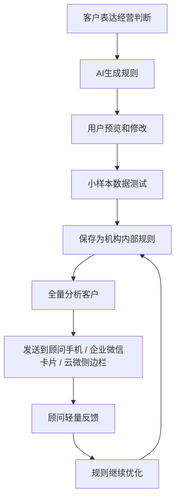

一句话概括：

> AI增长操作系统的价值不是一次性提供名单，而是把“经营经验”变成“可持续运行的规则资产”。

---

## 2. 为什么要做这件事

AI服务顾问效率线解决的是顾问重复劳动问题，例如客户问答、催资料、税金说明、风险解释和服务进度沟通。

AI增长操作系统解决的是另一个问题：

> 顾问效率被释放之后，如何进一步参与客户经营，并把服务关系转化为增长机会。

当前代账机构普遍存在四类问题：

| 问题 | 具体表现 | 系统能力 |
|---|---|---|
| 不知道谁值得关注 | 存量客户多，顾问靠经验判断优先级 | 用规则从存量客户中筛选目标企业 |
| 不知道为什么推荐 | 系统给结果但解释不足，顾问不敢用 | 给出命中依据、数据解释和聊天线索 |
| 不知道怎么沟通 | 顾问知道客户可能有机会，但缺少切入口 | 生成可复制、可修改的话术 |
| 经验无法沉淀 | 主管、销售、顾问有经验，但留在个人脑子里 | 将经营判断沉淀为企业内部规则 |

---

## 3. 资料来源与推导结论

### 3.1 亿企赢 / 客户洞察资料

已看到的能力与现象：

1. 客户可以从亿企赢导出客户标签数据；
2. 客户基于导出的标签数据，自行让开发做结果展示功能；
3. 自研展示结果中包含推荐产品、综合得分、维度评分、匹配依据、建议售卖方式、参考价格、备选产品、上下游关系和网络投放识别；
4. 相关规则支持阈值、权重、关键词、排除词配置；
5. 客户使用标签后，会继续加工成推荐结果、评分、售卖建议和跟进动作。

推导结论：

> 标签数据是基础价值，客户真正需要的是把标签进一步加工成“推荐方向 + 匹配评分 + 命中依据 + 建议话术 + 行动建议”。

对 AI增长操作系统的启发：

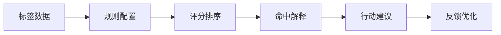

### 3.2 探迹资料与案例

探迹值得参考的是增长闭环方法：用企业数据和行业信号筛选目标客户，再把结果交给销售执行，并根据动作反馈持续优化策略。

可借鉴部分：

- 基于企业数据和行业信号筛选目标客户；
- 通过规则 / 模型判断客户优先级；
- 给一线人员提供触达理由和动作建议；
- 记录一线反馈；
- 用反馈反向优化筛选和触达策略。

推导结论：

> AI增长操作系统要学习“数据 + 规则 + 动作 + 反馈”的闭环，但场景应落在云帐房更有优势的存量客户经营和顾问工作流里。

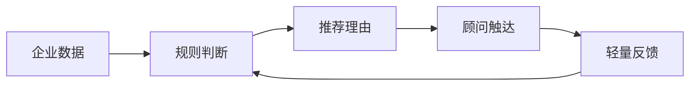

### 3.3 天工系统资料

《天工系统优势说明》提供了以下能力线索：

1. 多类商机规则，如代账、工商、税筹、知产、资质、法务；
2. 多维企业数据，如工商、财税、经营、关系、风险、健康度等；
3. 存量客户关系图谱和转介绍线索；
4. 业务健康度指标；
5. 商机成交 SOP 和风险洞察能力。

推导结论：

> 天工沉淀的规则、数据维度、关系图谱、健康度和 SOP 资产，可以作为 AI增长操作系统的规则模板、字段来源和业务经验输入。

同时，天工给出的反向启发也很重要：

| 现象 | 对 AI增长操作系统的要求 |
|---|---|
| 通用规则不一定匹配每家机构当前能做的业务 | 规则必须允许机构自行创建、复制和调整 |
| 固定规则扩展性有限 | 需要 AI 辅助生成规则，而不是只靠预置模板 |
| 后台商机不一定被顾问执行 | 结果必须进入企业微信 / 云微工作流 |
| 商机解释不足会影响采纳 | 每条推荐必须有命中依据和话术 |

### 3.4 现有产品规划资料

当前规划中已有三类基础：

1. AI服务顾问效率线：负责服务提效；
2. 客户洞察增长线：负责客户分层、商机识别、产品推荐、运营动作；
3. 字段字典设计：负责定义字段来源、口径、权限、可筛选、可评分、可解释。

推导结论：

> AI增长操作系统应继承客户洞察增长线的基础设计，并强化 AI生成规则、云微 / 企业微信工作流、顾问反馈和规则沉淀。

---

## 4. 与天工 / 洞察系统的本质区别

如果只是用固定规则筛选客户并输出名单，本质仍然属于洞察系统，难以形成足够差异化。

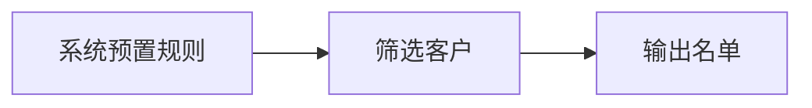

AI增长操作系统的核心区别在于：

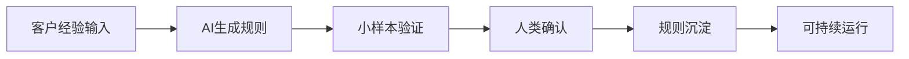

对比：

| 维度 | 洞察 / 名单系统 | AI增长操作系统 |
|---|---|---|
| 起点 | 系统预置规则 | 客户经营经验表达 |
| 核心能力 | 数据筛选 | 规则生成、验证与沉淀 |
| 用户参与 | 查看系统结果 | 共创、校验和确认规则 |
| 输出 | 客户名单 | 规则 + 可解释名单 + 行动建议 |
| 长期价值 | 单次洞察 | 可复用规则资产 |

固定规则仍然有价值，但它的定位应是基础验证能力，主要用于：

- 验证数据是否可用；
- 验证规则结果是否可解释；
- 作为现场规则共创的模板种子。

---

## 5. 产品目标

AI增长操作系统第一阶段要达成三个目标。

### 5.1 让数据可用

把客户、发票、财务、税务、服务、沟通等数据整理成可筛选、可打标签、可解释、可参与规则分析的字段资产。

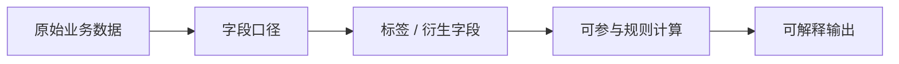

### 5.2 让规则可创建

让客户、主管或顾问可以用自然语言表达经营判断，AI生成结构化规则，用户可以预览、修改、小样本验证，最后保存为企业内部规则。

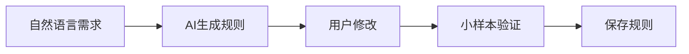

### 5.3 让行动发生

系统把规则运行结果送到顾问实际工作场景中，而不是停留在后台报表里。

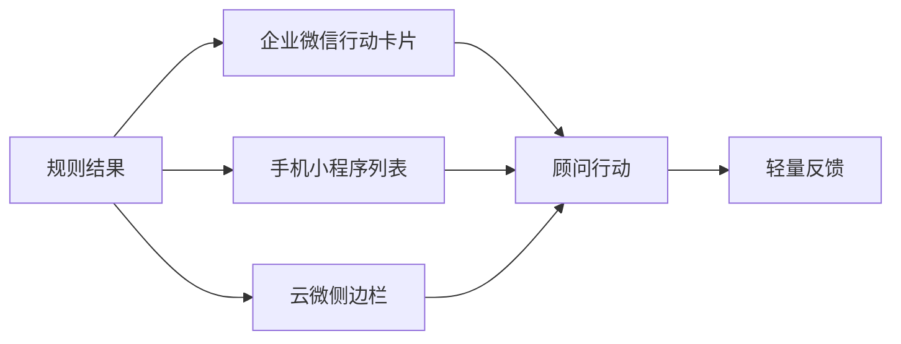

---

## 6. 核心设计原则

### 原则一：从字段、标签和规则引擎开始

第一阶段重点是把字段、标签、规则模板和批量分析能力跑通。AI的核心输出不是一段文本建议，而是结构化规则。

优先建设内容：

- 字段字典；
- 标签规则；
- 关键词词库；
- 规则条件组；
- 命中解释；
- 推荐等级；
- 结果列表。

### 原则二：AI生成的是可编辑规则，不是一次性答案

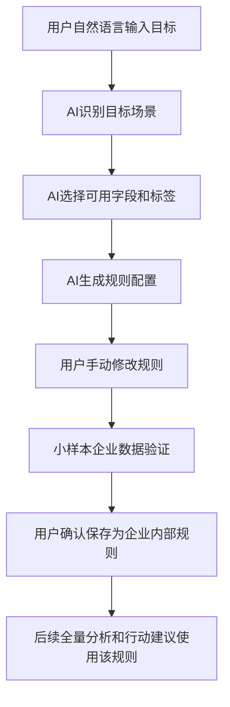

用户可修改内容：

| 可修改项 | 示例 |
|---|---|
| 字段 | 行业、经营范围、发票项目、聊天关键词 |
| 操作符 | 包含、大于、小于、近 N 个月 |
| 阈值 | 金额、次数、比例、时间周期 |
| 关键词 | 技术开发、广告投放、研发、融资 |
| 排除词 | 已服务、同行、注销、异常 |
| 权重 | 高 / 中 / 低，或具体分值 |
| 输出字段 | 企业名称、命中原因、推荐等级、顾问 |
| 命中解释 | 为什么推荐这家企业 |
| 建议话术 | 顾问可复制和修改的话术 |

### 原则三：规则先小样本验证，再全量运行

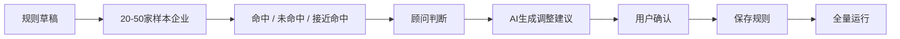

### 原则四：第一阶段不做重型 CRM

第一阶段不做成交管理、商机漏斗、销售过程监管、强任务分配。顾问端保持轻量反馈。

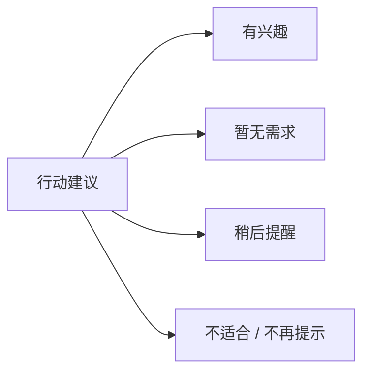

### 原则五：云微 / 企业微信既是触达入口，也是数据来源

云微 / 企业微信聊天记录不只是执行入口，也可以作为数据分析输入。

需要分析：

- 顾问和客户真实聊什么；
- 是否出现工商、税筹、融资、社保、开票、广告、高新、资质、合规等关键词；
- 客户是否主动表达需求；
- 顾问是否已经在聊天中做过推荐；
- 客户是否有异议或拒绝理由；
- 哪些问题高频出现，可以转成规则或模板。

---

## 7. 数据分层设计

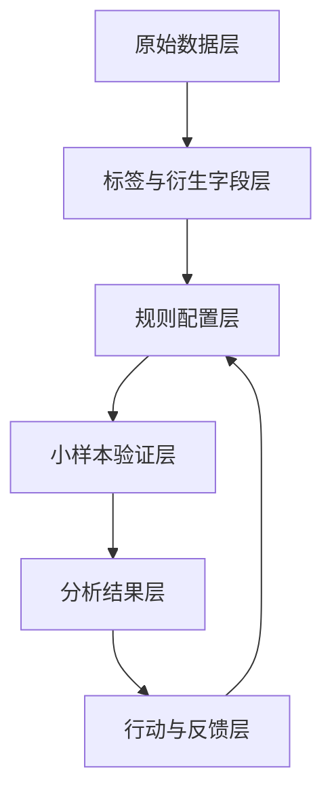

### 7.1 原始数据层

| 数据类型 | 示例 |
|---|---|
| 企业基础信息 | 名称、税号、行业、地址、成立时间、经营范围 |
| 工商数据 | 法人、股东、变更、关联企业、经营状态 |
| 发票数据 | 发票项目、金额、日期、关键词、供应商 |
| 财务数据 | 收入、利润、研发费用、库存、往来 |
| 税务数据 | 纳税人类型、纳税信用、税额、税负率、零申报 |
| 服务数据 | 服务时长、当前价格、凭证数、流水数、咨询次数 |
| 沟通数据 | 群消息、客户问题、顾问回复、关键词、客户意图 |
| 外部数据 | 风险、资质、知识产权、政策补贴、经营异常 |

### 7.2 标签与衍生字段层

示例标签：

- 高营收客户；
- 高票量客户；
- 低价高耗客户；
- 广告投放客户；
- 高新潜客；
- 工商变更意图；
- 社保增减员意图；
- 合规风险客户；
- 转介绍关系客户。

### 7.3 规则配置层

规则类型：

- 系统推荐模板；
- AI生成规则草稿；
- 用户修改规则；
- 企业内部规则；
- 候选通用规则。

### 7.4 分析结果与行动反馈层

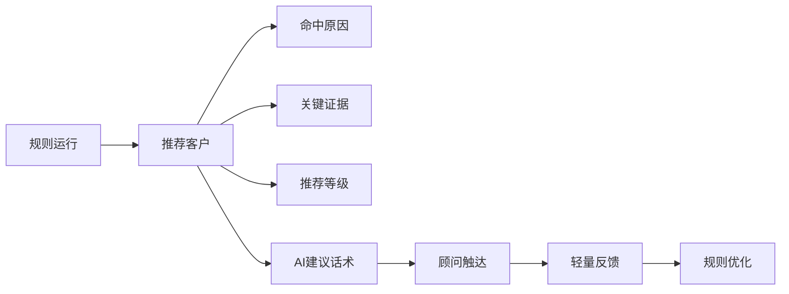

---

## 8. 产品最终形态：四层闭环

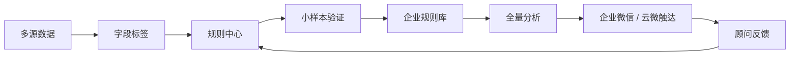

系统沉淀两类规则：

| 类型 | 说明 |
|---|---|
| 通用规则 | 可复制到多家机构的标准规则 |
| 企业规则 | 单一机构自身经营经验沉淀形成的规则 |

---

## 9. 规则中心：统一入口

规则中心是 AI增长操作系统的核心操作入口，承担规则创建、规则验证、规则保存和全量分析能力。

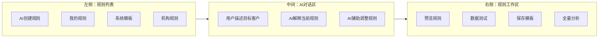

系统模板用于启发和快速开始。用户如需修改系统模板，应先保存为自己的规则副本，再进行编辑和运行。

---

## 10. 核心功能设计

### 10.1 小样本验证

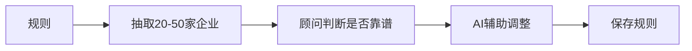

顾问反馈保持轻量：

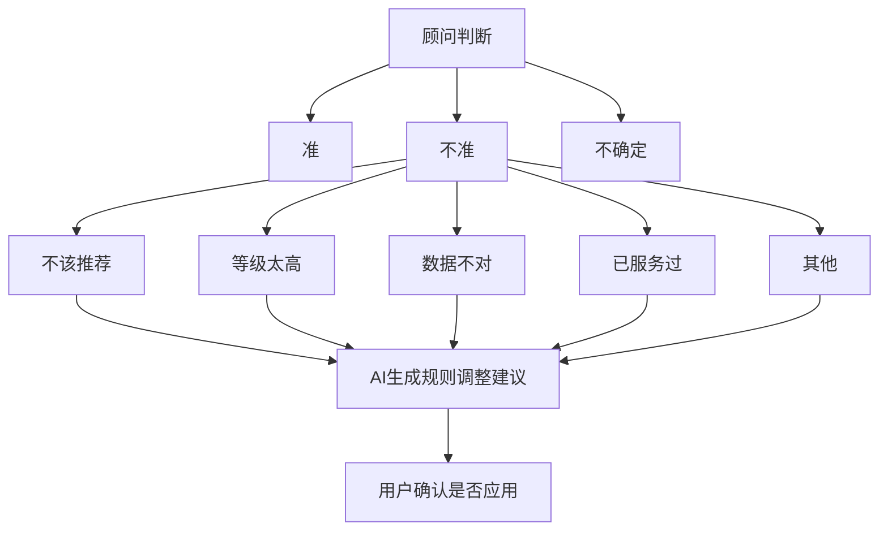

### 10.2 全量分析

保存后的规则可以手动触发全量分析，输出企业结果列表。

| 企业 | 推荐等级 | 分数 | 原因 | 顾问 | 操作 |
|---|---|---|---|---|---|

企业详情展示：

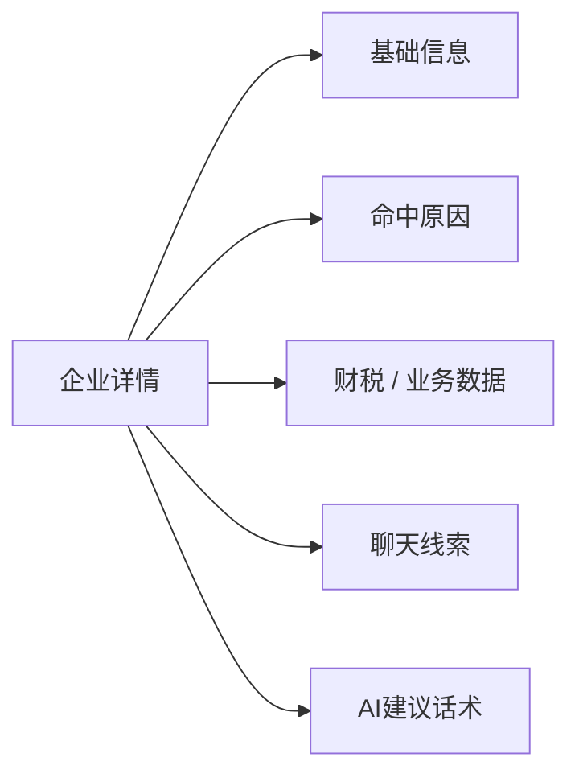

### 10.3 企业微信手机端

企业微信消息只作为行动入口，不承载全部信息。

进入小程序后，用“企业列表 + 单企业展开”的结构：

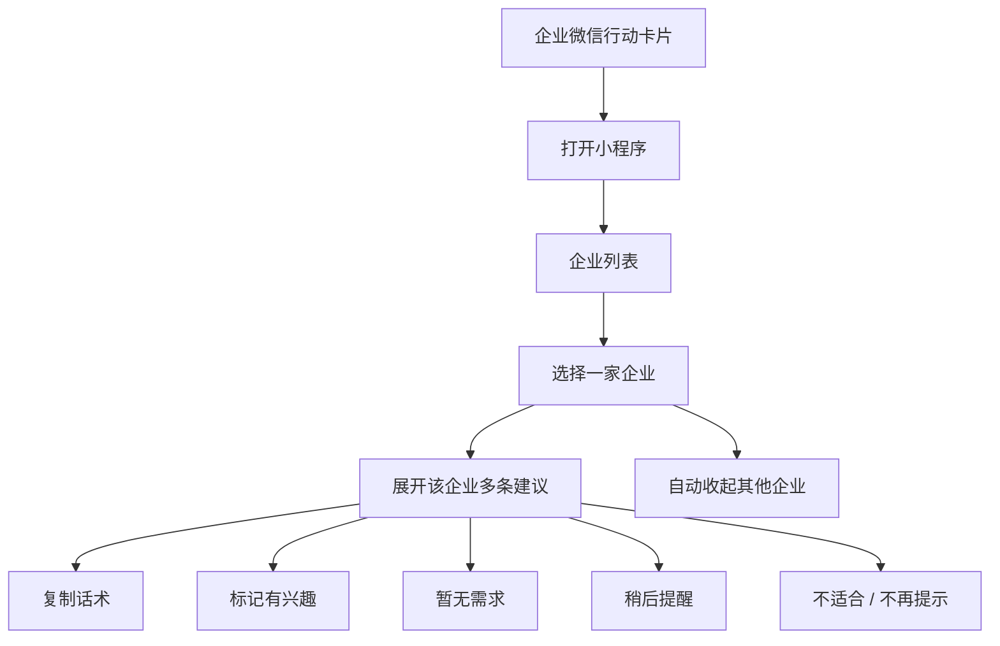

### 10.4 云微侧边栏

云微侧边栏对应电脑端企业微信对话场景。

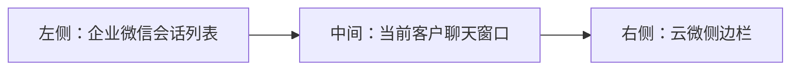

侧边栏只围绕当前客户提供辅助：

```mermaid
flowchart TD
    A["当前客户"] --> B["客户资料"]
    A --> C["机会提示"]
    C --> D["命中依据"]
    C --> E["聊天线索"]
    C --> F["AI建议话术"]
    F --> G["复制话术到输入框"]
    C --> H["稍后看 / 不再提示"]
```

### 10.5 规则质量反馈

第一阶段不使用成交指标，而是关注规则本身是否变准。

```mermaid
flowchart LR
    A["规则运行"] --> B["命中客户"]
    B --> C["顾问查看"]
    C --> D["轻量反馈"]
    D --> E["误判原因归类"]
    E --> F["AI优化建议"]
    F --> G["规则版本调整"]
    G --> A
```

建议指标：

| 指标 | 含义 |
|---|---|
| 运行次数 | 规则被执行了多少次 |
| 命中客户数 | 每次运行命中的客户规模 |
| 查看率 | 发送到手机或侧边栏后是否被打开 |
| 正向反馈率 | 顾问标记“有兴趣”的比例 |
| 不适合比例 | 顾问标记“不适合”的比例 |
| 误判原因 | 顾问反馈中反复出现的问题 |
| AI优化建议 | AI建议如何调整规则 |

---

## 11. MVP策略

MVP建议采用双路径验证：

```mermaid
flowchart LR
    A["MVP验证"] --> B["基线规则验证"]
    A --> C["现场AI规则共创"]
    B --> D["验证数据能力"]
    C --> E["验证产品能力"]
```

### 11.1 基线规则验证

候选基线规则：

- 高新申报客户；
- 涨价沟通客户；
- 广告投放客户；
- 工商变更客户；
- 贷款潜力客户。

基线验证目标：

```mermaid
flowchart LR
    A["基线规则"] --> B["跑通数据字段"]
    A --> C["验证命中解释"]
    A --> D["识别字段缺口"]
    A --> E["准备现场演示样本"]
```

### 11.2 现场AI规则共创

```mermaid
flowchart LR
    A["客户说需求"] --> B["AI生成规则"]
    B --> C["小样本验证"]
    C --> D["反馈调整"]
    D --> E["保存规则"]
    E --> F["全量运行"]
```

---

## 12. 配套页面样式与截图预留位置

> 截图建议直接贴在对应小节的“截图预留位置”下方。每个页面保留“用途说明 + 原型文件 + 截图位置 + 需要表达的重点”。

### 12.1 规则中心页面

原型文件：`docs/product-planning/prototypes/规则中心-找客户助手.html`

页面用途：展示用户如何用 AI 创建规则、选择系统模板、编辑自己的规则、小样本测试、保存规则并触发全量分析。

需要表达的重点：

- 左侧是规则入口；
- 中间是 AI 对话；
- 右侧是规则工作区；
- 我的规则和系统模板权限不同；
- 系统模板只能预览和测试，复制为草稿后才能修改；
- 全量分析需要手动触发。

截图预留位置：

> 在这里粘贴「规则中心主页面」截图。  
> 建议截图内容：左侧规则列表 + 中间 AI 对话 + 右侧规则工作区。

---

### 12.2 企业微信行动建议页面

原型文件：`docs/product-planning/prototypes/企业微信行动建议.html`

页面用途：展示顾问在手机端收到行动建议后，如何查看企业列表、展开单个企业、查看多条建议并进行轻量反馈。

需要表达的重点：

- 企业微信消息只是入口；
- 小程序里以企业为单位聚合建议；
- 一家企业可以有多条建议；
- 点击一家企业展开时，其他企业自动收起；
- 顾问只做轻量判断，不进入复杂 CRM。

截图预留位置：

> 在这里粘贴「企业微信行动建议手机页面」截图。  
> 建议截图内容：企业列表 + 单企业展开 + 建议详情 + 反馈按钮。

---

### 12.3 云微侧边栏页面

原型文件：`docs/product-planning/prototypes/云微侧边栏机会提示.html`

页面用途：展示电脑端企业微信聊天场景下，云微侧边栏如何根据当前客户展示机会提示、命中依据和建议话术。

需要表达的重点：

- 左侧是企业微信会话列表；
- 中间是当前客户聊天窗口；
- 右侧是云微侧边栏；
- 侧边栏只围绕当前客户给提示；
- 顾问可以复制话术、发送到手机、稍后提醒或不再提示。

截图预留位置：

> 在这里粘贴「云微侧边栏机会提示页面」截图。  
> 建议截图内容：企业微信聊天窗口 + 右侧客户画像 + AI发现机会 + 建议话术。

---

## 13. 贷款公司验证案例

贷款公司验证的重点不是简单筛选贷款客户，而是验证“业务经验结构化能力”。

```mermaid
flowchart LR
    A["贷款业务人员表达经验"] --> B["AI生成规则"]
    B --> C["小样本测试"]
    C --> D["业务人员判断准不准"]
    D --> E["AI辅助修正规则"]
    E --> F["沉淀为机构内部规则"]
```

示例需求：

- 帮我找近期可能有资金需求的企业。
- 帮我找开票增长但现金流压力可能比较大的企业。
- 帮我找有扩张迹象、可能需要贷款的企业。

验证重点：

> AI能否把贷款公司的业务经验转成规则，并跑到我们的客户数据上。

---

## 14. 阶段规划、支撑与周期预估

### 14.1 总体阶段关系

```mermaid
flowchart LR
    A["阶段1：数据与规则盘点"] --> B["阶段2：基线规则验证"]
    B --> C["阶段3：规则中心原型"]
    C --> D["阶段4：工作流接入"]
    D --> E["阶段5：规则沉淀与规模化"]
```

### 14.2 阶段明细

| 阶段 | 周期预估 | 目标 | 关键产出 |
|---|---:|---|---|
| 阶段1：数据与规则盘点 | 1-2周 | 确认数据能否支撑第一批规则 | P0字段字典、候选规则、数据缺口清单 |
| 阶段2：基线规则验证 | 2周 | 验证规则能否跑出有解释价值的结果 | 小样本名单、命中解释、规则调整意见 |
| 阶段3：规则中心原型 | 3-4周 | 跑通 AI生成规则、编辑、测试、保存、全量分析 | 规则中心原型、规则保存能力、全量分析页 |
| 阶段4：工作流接入 | 3-4周 | 让结果进入顾问日常场景 | 企业微信卡片、小程序列表、云微侧边栏、轻量反馈 |
| 阶段5：规则沉淀与规模化 | 持续迭代 | 把有效规则沉淀为资产 | 通用规则库、企业规则库、规则质量反馈 |

### 14.3 各阶段需要的支撑

| 阶段 | 数据支撑 | 产品支撑 | 业务支撑 | 技术 / AI支撑 |
|---|---|---|---|---|
| 阶段1 | 财云、发票、税务、服务、云微聊天样本 | 字段口径、规则模板初稿 | 可售服务方向、顾问真实场景 | 聊天记录可读取范围、脱敏方案 |
| 阶段2 | 离线跑数、样本企业数据 | 名单样例、解释口径 | 顾问 / 销售 / 老板评审 | AI生成命中解释和建议话术 |
| 阶段3 | 字段接口、样本查询、权限控制 | 规则配置交互、小样本验证交互 | 试点客户共创规则 | 自然语言转结构化规则 |
| 阶段4 | 规则结果数据、顾问客户归属 | 企业微信卡片、小程序、云微侧边栏 | 定义反馈选项 | 话术生成、聊天上下文摘要 |
| 阶段5 | 规则运行数据、反馈数据 | 规则版本、模板复制、规则库 | 提炼通用增长场景 | AI规则优化建议 |

### 14.4 近期推进计划

近期建议先做三件事：

1. 做数据与规则盘点：明确哪些字段现在可用，哪些规则能跑，云微聊天记录能分析到什么；
2. 做基线规则验证：用现有数据先跑一批样本，拿给顾问 / 销售 / 老板判断是否有价值；
3. 做规则中心原型：让客户现场提出需求，AI生成规则，用户修改后用少量企业数据验证，最后保存为企业内部规则。

---

## 15. 需要领导支持的事项

| 支持事项 | 说明 |
|---|---|
| 试点客户支持 | 需要选择1-2家愿意配合数据分析和现场共创规则的代账公司 |
| 数据协同支持 | 需要财云、云微、发票、服务过程、聊天记录等数据样本支持 |
| 业务资源支持 | 需要顾问 / 销售参与样本评审，提供真实规则和反馈 |
| 云微 / 企业微信接入排期支持 | 第一阶段可以离线验证，后续需要进入顾问工作流 |
| AI规则生成探索支持 | 需要允许先做轻量原型，验证自然语言生成规则 + 小样本验证链路 |

---

## 16. 风险与应对

| 风险 | 说明 | 应对 |
|---|---|---|
| 字段口径不清 | 数据无法支撑规则稳定运行 | 阶段1先做字段字典和口径确认 |
| 规则过宽 | 命中客户多但价值低 | 小样本验证，加入排除词、阈值和人工反馈 |
| 用户不会创建规则 | 规则引擎门槛高 | AI生成规则配置，用户只做修改和确认 |
| 顾问不愿反馈 | 复杂流程容易增加抵触 | 用轻量按钮反馈替代重型流程 |
| 只沉淀私有规则 | 通用化不足 | 持续识别多家客户都适用的规则，沉淀为通用模板 |
| 云微接入慢 | 行动闭环延后 | 先离线验证，再接企业微信 / 云微行动入口 |

---

## 17. 最终判断标准

第一阶段验证成功的标准不是是否导出了一批名单，也不是是否形成成交数据，而是：

> 是否可以把“客户经验”稳定转成“可执行规则”，并进入顾问日常工作动作。

具体判断：

```mermaid
flowchart TD
    A["验证成功"] --> B["AI能根据自然语言生成可理解规则"]
    A --> C["顾问能用小样本判断规则是否靠谱"]
    A --> D["规则能根据反馈持续调整"]
    A --> E["规则能保存为机构内部规则"]
    A --> F["全量分析结果能进入企业微信或云微侧边栏"]
    A --> G["顾问轻量反馈能反哺规则优化"]
```

---

## 18. 汇报建议话术

可以这样讲：

> 我们建议把增长方向设计成 AI增长操作系统。它的起点不是单纯输出客户名单，而是把客户和机构自己的经营经验转成可运行、可验证、可复用的规则。用户可以通过自然语言表达想找什么客户，AI生成规则，用户预览和修改，再用少量企业样本验证，确认后保存为企业内部规则。保存后的规则可以全量分析存量客户，结果进入企业微信手机端和云微侧边栏，由顾问轻量反馈，系统再反过来优化规则。第一阶段重点不是重型CRM，也不是成交闭环，而是验证“经验到规则，再到顾问行动”的产品链路是否成立。

---

## 19. 近期最重要的产出

> P0字段字典 + 聊天记录商机分析 + 第一批候选规则模板 + 基线规则验证 + 规则中心原型 + 企业微信 / 云微触达原型。
