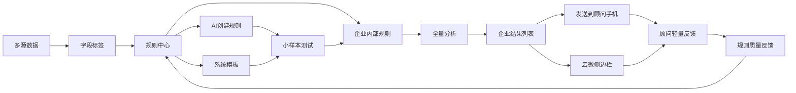
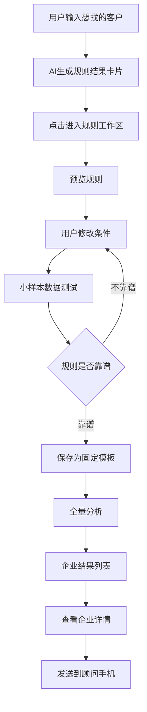
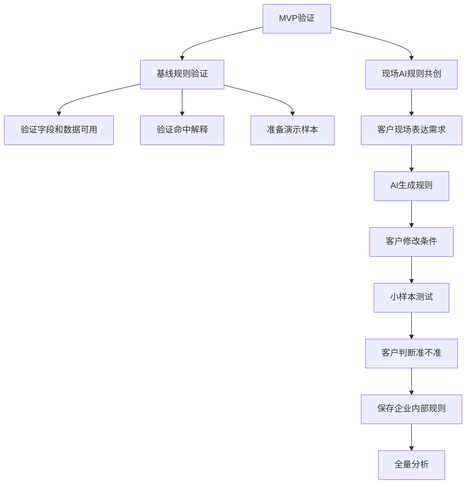

# AI增长操作系统领导评审文档

> 面向对象：公司管理层 / 产品决策会  
> 汇报目的：明确 AI 增长操作系统的产品边界、差异化定位、验证路径、阶段计划和资源需求。  
> 文档性质：领导评审版，不是详细 PRD。

---

## 1. 核心结论

AI增长操作系统不是再做一个“客户洞察名单系统”，而是要做一套 **把客户经营经验转成可运行、可验证、可复用规则的系统**。

它基于云帐房已有的客户数据、票财税数据、服务过程数据、云微 / 企业微信沟通数据和外部企业信息，让代账机构可以完成以下闭环：

```text
客户说出经营判断
  ↓
AI生成规则
  ↓
用户预览和修改
  ↓
小样本数据测试
  ↓
保存为机构自己的规则
  ↓
全量分析客户
  ↓
发送到顾问手机 / 云微侧边栏
  ↓
顾问轻量反馈
  ↓
规则继续优化
```

一句话概括：

> 我们不是只给客户一批名单，而是帮助客户把自己的业务经验变成可反复运行的客户经营规则。

---

## 2. 与天工洞察的区别

如果只是用几条固定规则跑客户名单，再导出给用户看，这件事和天工洞察系统差异不大。

这种方式的本质是：

```text
系统预置规则
  ↓
筛出客户名单
  ↓
导出给用户查看
```

这只能证明我们有数据和规则，不能构成足够强的产品差异化。

AI增长操作系统的差异化应该放在另一件事上：

```text
客户现场表达业务经验
  ↓
AI把经验转成规则
  ↓
现场测试少量客户
  ↓
客户判断准不准
  ↓
AI辅助调整规则
  ↓
保存成该机构自己的规则
  ↓
后续可反复运行
```

对比关系：

| 维度 | 天工 / 洞察类系统 | AI增长操作系统 |
|---|---|---|
| 核心起点 | 系统已有规则和洞察 | 客户自己的经营经验 |
| 用户参与方式 | 看系统给出的名单 | 现场共创、修改和验证规则 |
| 规则形态 | 预置规则为主 | 通用模板 + 企业内部规则 |
| 结果输出 | 客户名单 / 洞察报告 | 可解释名单 + 手机卡片 + 云微侧边栏 |
| 长期价值 | 看一次名单 | 沉淀可复用规则资产 |
| 差异化重点 | 数据洞察 | AI生成规则、验证规则、沉淀规则 |

因此，固定规则可以做，但不能被包装成产品核心。

固定规则的定位应是：

1. 验证数据字段能否支撑规则；
2. 验证命中结果是否可解释；
3. 准备现场演示样本；
4. 作为客户不知道怎么提需求时的模板种子。

---

## 3. 产品最终要形成什么闭环

AI增长操作系统要形成四层闭环。



这套系统的重点不是一次性生成商机名单，而是持续沉淀两类规则：

| 规则类型 | 含义 | 价值 |
|---|---|---|
| 通用模板 | 多家机构都适用的规则 | 可产品化、可规模化复制 |
| 企业内部规则 | 某家机构自己的经营经验 | 提升客户粘性，适配个性化经营 |

---

## 4. 为什么要做这件事

AI服务顾问解决的是顾问重复劳动问题，例如客户问答、资料催收、税金说明、风险解释和服务进度沟通。

AI增长操作系统解决的是下一步问题：

> 顾问节省出来的时间，如何转化为客户经营动作和增收机会。

从代账机构经营视角看，它要解决四个问题：

| 问题 | AI增长操作系统的回答 |
|---|---|
| 不知道哪些客户值得经营 | 用规则从存量客户中找出可关注客户 |
| 不知道为什么推荐这个客户 | 给出命中依据、相关数据和聊天线索 |
| 不知道顾问该怎么开口 | 生成可复制、可修改的话术 |
| 经验无法沉淀 | 保存为企业内部规则或候选通用模板 |

---

## 5. 资料依据与推导结论

### 5.1 亿企赢 / 客户洞察方向

已有资料显示，客户可以从亿企赢导出客户标签数据，并基于这些标签数据自行开发结果展示功能。

客户自研结果中包含：

- 推荐产品；
- 综合得分；
- 六维度评分；
- 匹配依据；
- 建议售卖方式；
- 参考价格；
- 备选产品；
- 上下游关系与网络投放识别；
- 阈值、权重、关键词、排除词配置。

推导结论：标签数据只是基础，客户真正使用时会继续加工成推荐方向、评分、依据、建议和动作。

因此，我们不能只停留在标签和名单层，要做规则生成、规则验证、规则复用和行动入口。

### 5.2 探迹方向

探迹值得借鉴的是增长闭环方法：

```text
数据
  ↓
规则 / 模型
  ↓
销售或顾问动作
  ↓
过程反馈
  ↓
规则继续优化
```

但当前阶段不适合直接做重 CRM 或成交管理。我们的第一阶段应保持轻量：只做建议、话术、发送到手机和顾问简单反馈。

### 5.3 天工方向

《天工系统优势说明》体现了几类可借鉴资产：

- 商机规则；
- 企业数据维度；
- 存量客户关系图谱；
- 业务健康度指标；
- 风险洞察和报告；
- 业务 SOP。

天工提供的是规则、数据和洞察资产。AI增长操作系统应吸收这些资产，但产品重点要落在：

```text
规则可生成
规则可修改
规则可测试
规则可保存
规则可全量运行
结果可进入顾问工作流
反馈可反哺规则
```

---

## 6. 产品信息架构调整

原先文档中“AI规则助手”和“规则模板中心”拆成两个页面，容易造成使用割裂。

现在建议合并为一个核心页面：**规则中心**。

规则中心同时承载：

1. AI对话创建规则；
2. 系统推荐模板；
3. 我的规则；
4. 机构规则；
5. 规则预览和修改；
6. 小样本数据测试；
7. 保存模板；
8. 全量分析入口。

主链路页面收敛为四个：

| 页面 | 使用对象 | 核心作用 |
|---|---|---|
| 规则中心 | 顾问 / 运营 / 主管 | AI创建规则、测试规则、保存模板、全量找客户 |
| 企业微信行动卡片 | 顾问 | 在手机上查看今日建议企业和多条建议 |
| 云微侧边栏 | 顾问 | 在电脑端企业微信对话中查看当前客户机会和话术 |
| 规则质量反馈 | 产品运营 / 规则运营 | 查看规则是否被采纳、是否误判、是否需要调整 |

其中“规则质量反馈”不建议作为独立大看板优先建设，第一阶段可以放在规则详情内。

---

## 7. 核心流程一：规则中心

规则中心的交互方式是：左侧规则列表，中间 AI 对话，右侧规则工作区。

```text
左侧：规则列表
  - AI创建规则
  - 我的规则
  - 系统模板
  - 机构规则

中间：AI对话
  - 用户说想找什么客户
  - AI生成结果卡片
  - 点击卡片进入右侧规则工作区

右侧：规则工作区
  - 预览规则
  - 修改条件
  - 数据测试
  - 保存模板
  - 全量分析
```

流程：



规则配置保留结构化能力，但文案要让普通顾问看得懂。

| 配置项 | 示例 |
|---|---|
| 规则名称 | 高新申报客户 |
| 客户范围 | 我的客户 / 全部在服客户 / 指定客户分组 |
| 推荐方向 | 高新申报评估 |
| 条件类型 | 必须满足 / 任一满足 / 排除 |
| 看什么 | 客户行业 / 关键词 / 财税数据 / 客户状态 |
| 怎么判断 | 科技、软件、制造、环保 / 研发费用 / 技术服务发票 |
| 重要度 | 高 / 中 / 低 |
| 输出内容 | 企业、推荐等级、分数、主要原因、顾问、详情 |

---

## 8. 核心流程二：小样本数据测试

规则生成后，先用少量企业测试，再决定是否保存和全量运行。

这里要强调：小样本测试不是导出名单给客户看，而是验证规则是否靠谱。

小样本测试页面需要展示：

| 区域 | 内容 |
|---|---|
| 测试范围 | 我的客户 / 全部在服客户 / 指定分组 |
| 测试数量 | 20-50 家企业 |
| 命中企业 | 符合规则的企业 |
| 接近命中企业 | 差一点满足规则的企业 |
| 不建议企业 | AI判断不适合跟进的企业 |
| 命中原因 | 命中字段、关键词、金额、次数、聊天线索 |
| 用户反馈 | 准 / 不准 / 先不跟 |
| 调整入口 | 修改条件、关键词、排除项、阈值、重要度 |

验证目标：

1. 数据能否支撑这条规则；
2. 命中依据能否解释清楚；
3. 客户是否认可规则逻辑；
4. 规则是否值得保存为企业内部规则。

---

## 9. 核心流程三：全量分析与发送到手机

保存后的规则可以全量运行，输出企业结果列表。

结果列表不做卡片流，建议使用表格列表：

| 企业 | 推荐等级 | 分数 | 主要原因 | 顾问 | 操作 |
|---|---|---|---|---|---|
| A科技有限公司 | 高 | 92 | 软件开发；研发费用；聊天提到研发项目 | 张三 | 详情 / 发手机 |
| B商贸有限公司 | 高 | 88 | 低价高耗；凭证增加；咨询次数高 | 张三 | 详情 / 发手机 |
| C传媒有限公司 | 中 | 76 | 发票命中广告投放；供应商多为广告公司 | 王五 | 详情 / 发手机 |

点击详情后从右侧展开企业详情，展示：

- 基础信息；
- 命中原因；
- 相关财税 / 业务数据；
- 聊天线索；
- AI建议话术；
- 发送到顾问手机。

这里不做“加入跟进”，因为第一阶段不做跟进管理，也不维护合同 / 成交流程。

正确动作是：

> 将客户建议通过企业微信小程序卡片发送到顾问手机，顾问自己判断是否联系。

---

## 10. 核心流程四：企业微信行动卡片

顾问日常入口应在手机端，而不是后台网页。

企业微信消息只做摘要入口：

```text
今日建议查看 6 家企业
共 11 条建议
2 家高推荐
点击打开小程序查看
```

打开小程序后，用“企业列表 + 单企业展开”的结构。

原因：

1. 一家企业可能有多条建议；
2. 企业很多时，默认展示列表更清晰；
3. 点击一家企业展开详情，同时自动收起其他企业；
4. 顾问在手机上只做轻动作。

小程序中每个企业展示：

- 企业名称；
- 顾问；
- 推荐等级；
- 建议数量；
- 展开后的多条建议；
- 每条建议的原因和话术。

轻量动作：

```text
复制话术
有兴趣
暂无需求
稍后提醒
不适合
```

这些反馈用于规则质量优化，不代表我们进入 CRM 或成交管理。

---

## 11. 核心流程五：云微侧边栏

云微侧边栏的场景是电脑端企业微信对话界面。

页面形态应是：

```text
左侧：企业微信功能栏
中间左侧：聊天列表
中间：当前客户群对话
右侧：云微侧边栏
```

侧边栏只围绕当前对话提供辅助：

- 当前客户资料；
- 当前客户机会提示；
- 命中依据；
- 聊天线索；
- AI建议话术；
- 复制话术到输入框；
- 稍后看 / 不再提示。

不做重型 CRM 功能，不做转销售，不做成交流程。

---

## 12. 规则质量反馈如何处理

原文档中的“规则效果看板”容易被理解成经营结果看板，并且出现了成交数、成交金额等当前阶段没有数据链路支撑的指标。

建议调整为“规则质量反馈”，第一阶段放到规则详情内，不作为独立主页面。

规则质量反馈只看规则是否变准：

| 指标 | 含义 |
|---|---|
| 运行次数 | 规则被使用了多少次 |
| 命中客户数 | 每次运行命中的客户规模 |
| 顾问查看率 | 发送后顾问是否打开查看 |
| 正向反馈率 | 顾问标记“有兴趣”的比例 |
| 不适合比例 | 顾问标记“不适合”的比例 |
| 常见误判原因 | 用户反馈中提到的误判点 |
| AI优化建议 | 是否需要加排除条件、调关键词、改阈值 |

不展示：

- 成交数；
- 成交金额；
- 回款；
- 销售漏斗；
- 合同转化。

原因：第一阶段系统不维护合同和成交流程，不能用没有闭环的数据包装效果。

---

## 13. MVP验证方式

MVP不应被表述为“先用固定规则跑名单给客户看”。

建议改成“两条腿走路”：



### 13.1 基线规则验证

作用：验证数据和规则引擎，不作为产品核心卖点。

可选基线规则：

1. 高新申报客户；
2. 涨价沟通客户；
3. 广告投放客户；
4. 工商变更客户；
5. 融资 / 贷款潜力客户。

产出：

- 数据字段缺口；
- 规则可解释性验证；
- 可演示样本；
- 初步模板种子。

### 13.2 现场AI规则共创

作用：验证真正的产品差异化。

现场流程：

1. 客户说出想找什么客户；
2. AI生成规则；
3. 客户修改条件、关键词、排除项；
4. 抽取 20-50 家企业测试；
5. 客户标记准 / 不准 / 先不跟；
6. AI辅助调整规则；
7. 保存为该机构内部规则；
8. 全量分析；
9. 发送到顾问手机或云微侧边栏。

---

## 14. 贷款公司验证案例

如果选择贷款公司作为试点，不能只做“贷款潜力客户固定规则跑名单”。

建议验证方式：

```text
先用贷款潜力客户模板做基线
  ↓
验证数据是否能识别企业资金需求信号
  ↓
让贷款公司现场说出他们判断客户是否可能贷款的经验
  ↓
AI把这些经验生成规则
  ↓
现场小样本测试
  ↓
贷款公司判断哪些准、哪些不准
  ↓
保存为贷款公司自己的客户筛选规则
```

可测试的自然语言需求示例：

```text
帮我找近期可能有资金需求的企业。

帮我找开票增长但现金流压力可能比较大的企业。

帮我找有扩张迹象、可能需要贷款的企业。

帮我找经营稳定但近期税票和流水变化明显的企业。
```

验证重点不是“我们能不能筛出贷款客户”，而是：

> AI能不能把贷款公司的业务经验转成规则，并跑到我们的客户数据上。

---

## 15. 阶段计划

### 阶段1：数据与规则盘点（1-2周）

目标：确认第一批规则所需的数据字段、标签和聊天线索是否具备。

| 工作 | 支撑 |
|---|---|
| 梳理 P0 字段字典 | 产品、数据 |
| 梳理标签和衍生字段 | 产品、数据 |
| 梳理已有规则和天工规则资产 | 产品、业务 |
| 分析云微聊天记录中的商机关键词 | 数据、云微、AI |
| 访谈顾问 / 销售 / 客户经营人员 | 业务 |
| 形成候选模板和数据缺口清单 | 产品、业务 |

产出：P0字段字典、候选规则模板、数据缺口、现场共创问题清单。

### 阶段2：基线规则验证（2周）

目标：验证数据和规则引擎是否能跑出有解释力的样本。

| 工作 | 支撑 |
|---|---|
| 选择 3-5 条基线规则 | 产品、业务 |
| SQL / 脚本 / 规则引擎跑样本 | 数据、研发 |
| 输出命中原因和AI解释 | AI、产品 |
| 内部顾问 / 业务评审样本 | 业务 |
| 记录字段缺口和误判原因 | 产品、数据 |

产出：基线样本、字段缺口、误判原因、可演示模板。

### 阶段3：规则中心原型（3-4周）

目标：完成 AI 对话创建规则、规则预览、数据测试、保存模板、全量分析的一体化原型。

| 工作 | 支撑 |
|---|---|
| AI自然语言生成规则 | AI、研发 |
| 规则配置表编辑 | 产品、研发 |
| 小样本测试 | 数据、研发 |
| 全量分析结果列表 | 数据、研发 |
| 企业详情抽屉 | 产品、研发 |
| 发送到顾问手机入口 | 企业微信 / 云微、研发 |

产出：规则中心原型。

### 阶段4：顾问工作流入口（3-4周）

目标：让规则结果进入顾问实际工作场景。

| 工作 | 支撑 |
|---|---|
| 企业微信消息卡片 | 企业微信、研发 |
| 小程序企业列表展开页 | 产品、研发 |
| 云微侧边栏机会提示 | 云微、研发 |
| AI话术复制 | AI、研发 |
| 顾问轻量反馈 | 产品、研发 |

产出：企业微信行动卡片、手机小程序、云微侧边栏。

### 阶段5：规则质量反馈与模板沉淀（持续）

目标：把正反馈规则沉淀为可复用模板。

产出：规则质量反馈、通用模板库、企业内部规则库、规则优化建议。

---

## 16. 需要的支持

| 支持项 | 说明 |
|---|---|
| 试点客户 | 选择 1-2 家愿意配合数据分析和现场规则共创的机构 |
| 数据协同 | 财云、发票、税务、服务、云微聊天记录样本 |
| 业务参与 | 顾问、销售、客户经营人员参与样本判断和规则共创 |
| 云微 / 企业微信接入 | 用于手机卡片和侧边栏原型验证 |
| AI原型资源 | 支持自然语言生成规则和命中解释 |

---

## 17. 风险与应对

| 风险 | 表现 | 应对 |
|---|---|---|
| 被理解为天工洞察重复建设 | 领导认为只是固定规则跑名单 | 明确固定规则只是基线，核心是 AI 现场规则共创 |
| 字段口径不清 | 规则跑不稳定 | 阶段1先做字段字典和口径确认 |
| 规则过宽 | 名单多但价值低 | 小样本测试、排除条件、关键词和阈值调整 |
| 用户不会配置规则 | 配置门槛高 | 用 AI 对话生成规则，用户只预览和修改 |
| 顾问不愿反馈 | CRM式流程有抵触 | 手机卡片和云微侧边栏只做轻量动作 |
| 误用成交指标 | 当前没有合同闭环 | 第一阶段只看规则质量，不看成交数据 |
| 云微接入排期慢 | 工作流闭环延后 | 先做企业微信小程序卡片和离线原型验证 |

---

## 18. 汇报建议话术

> AI增长操作系统不是再做一个固定规则跑名单的洞察系统。固定规则只是基线验证，用来确认数据、规则和解释能力是否可用。真正的产品核心是现场规则共创：客户把自己的经营经验说出来，AI生成可编辑规则，现场用少量企业测试，客户判断准不准，确认后保存为企业内部规则。保存后的规则可以全量分析客户，并通过企业微信手机卡片或云微侧边栏进入顾问工作流。后续我们根据顾问反馈持续优化规则，把多家机构都验证有效的规则沉淀为通用模板，把单家机构自己的规则沉淀为企业内部规则。

---

## 19. 最终建议

近期重点推进五个产出：

1. P0字段字典；
2. 云微聊天记录商机关键词分析；
3. 第一批基线规则模板；
4. 现场 AI 规则共创验证；
5. 规则中心原型。

第一阶段验证成功的标准：

> AI能够根据客户现场表达生成可编辑规则；客户能用少量企业样本判断规则是否靠谱；规则确认后能保存为企业内部规则，并全量分析出可解释的客户列表，发送到顾问手机或云微侧边栏。