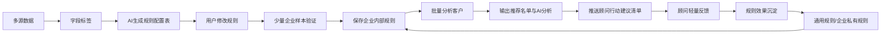
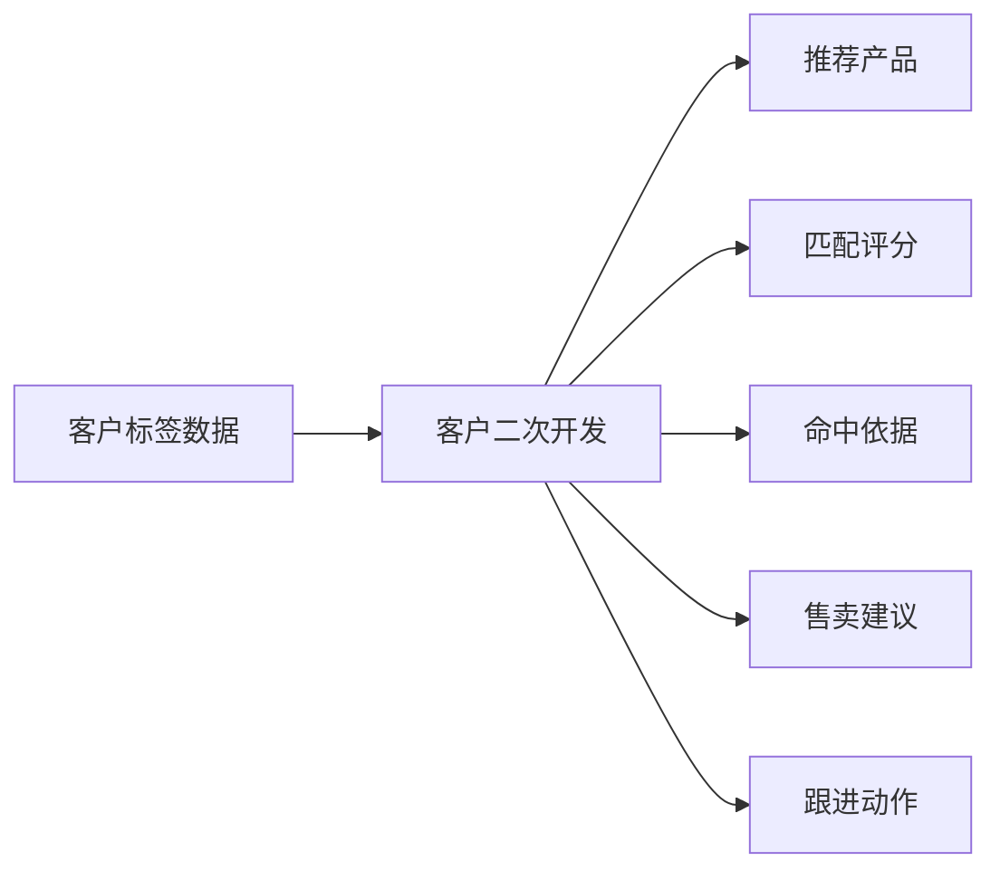
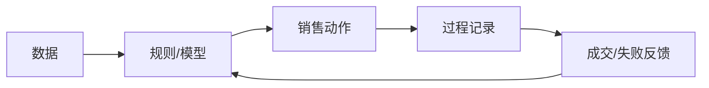
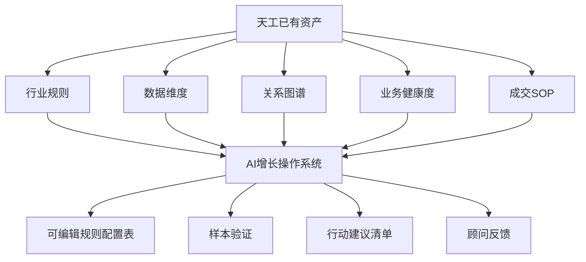
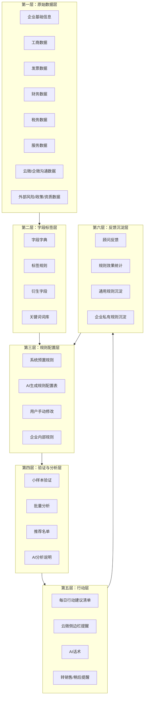
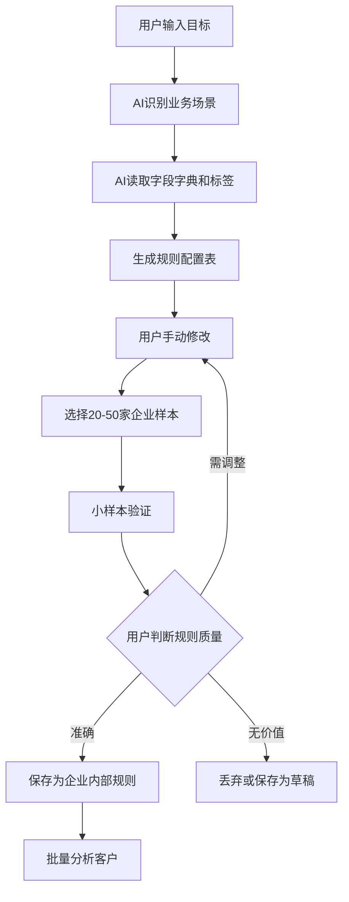
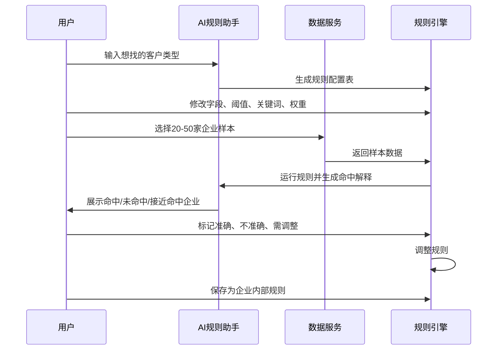
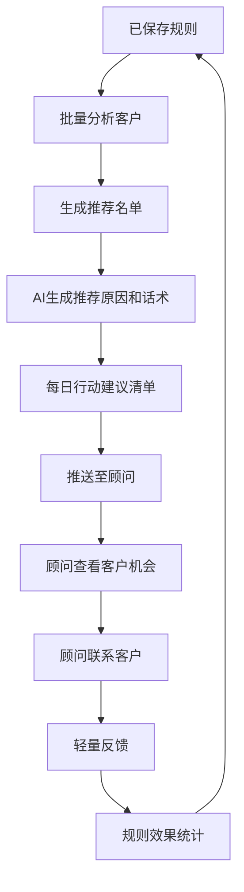
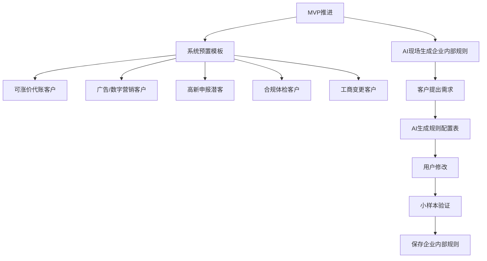
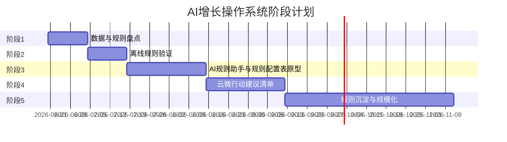

# AI增长操作系统汇报文档

> 面向对象：公司管理层 / 产品决策会  
> 汇报目的：说明 AI 增长操作系统的产品方向、依据、核心架构、关键流程、界面形态、阶段计划和资源需求。  
> 文档性质：领导汇报版，可直接阅读，不是详细 PRD。  

---

## 1. 核心结论

AI增长操作系统是一套面向代账公司顾问、销售、主管和老板的存量客户增长系统。

它基于云帐房已有的客户数据、票财税数据、服务过程数据、云微/企微沟通数据和外部企业信息，通过 **数据标签、规则引擎、AI规则助手、样本验证、批量分析、行动建议清单和顾问反馈**，帮助代账公司持续发现可跟进的增长机会。

核心目标：

> 让代账公司把“经验式客户经营”升级为“数据驱动 + AI辅助 + 可沉淀规则”的增长方法。

---

## 2. 产品要做成什么样

AI增长操作系统最终要形成一个循环：



这套系统的重点不是一次性生成商机名单，而是持续沉淀两类规则：

| 规则类型 | 含义 | 价值 |
|---|---|---|
| 通用规则 | 多家代账公司都适用的规则 | 可产品化、可规模化复制 |
| 企业内部规则 | 某家代账公司自己的经营经验 | 提升客户粘性，适配个性化经营 |

---

## 3. 为什么要做这件事

AI服务顾问效率线解决的是顾问重复劳动问题，例如客户问答、资料催收、税金说明、风险解释和服务进度沟通。

AI增长操作系统解决的是下一步问题：

> 顾问节省出来的时间，如何转化为客户经营动作和增收机会。

从代账公司的经营视角看，它要解决四个问题：

| 问题 | AI增长操作系统的回答 |
|---|---|
| 不知道哪些客户值得经营 | 用字段标签和规则筛出客户名单 |
| 不知道为什么推荐这个客户 | 用AI生成命中依据和分析说明 |
| 不知道顾问该怎么跟 | 生成行动建议和沟通话术 |
| 规则和经验不能沉淀 | 将规则保存为企业内部规则或通用规则 |

---

## 4. 资料依据与推导结论

### 4.1 亿企赢 / 客户洞察方向

已有资料显示：客户可以从亿企赢导出客户标签数据，并基于这些标签数据自行开发结果展示功能。

客户自研结果中包含：

- 推荐产品；
- 综合得分；
- 六维度评分；
- 匹配依据；
- 建议售卖方式；
- 参考价格；
- 备选产品；
- 上下游关系与网络投放识别；
- 阈值、权重、关键词、排除词配置。

推导结论：



标签数据是基础，客户真正使用时会继续加工成“推荐方向、评分、依据、建议和动作”。

---

### 4.2 探迹方向

探迹值得借鉴的是增长闭环方法：



探迹案例给出的启发：

| 案例 | 看到的能力 | 对我们的启发 |
|---|---|---|
| 联贝 | 提升销售动作命中率 | 同样动作量，前置客户筛选越准，效率越高 |
| 易账无忧 | 从低客单关系延伸到高客单服务 | 增长不只来自新客户，也来自存量客户价值升级 |
| 睿成 | AI工具 + 销售SOP + 过程管理 | 工具要进入动作和记录闭环 |
| 华运昌 | 行业客群重构 | 增长机会也来自业务策略配置 |

---

### 4.3 天工方向

《天工系统优势说明》体现了几类可借鉴资产：

- 六大类商机规则：代账、工商、税筹、知产、资质、法务；
- 8大类88种企业数据维度；
- 存量客户关系图谱与转介绍线索；
- 五大业务健康度指标；
- 商机成交SOP；
- 金四风险洞察和报告。

天工提供的是规则、数据、关系图谱、SOP等业务资产。AI增长操作系统吸收这些资产，并把它们转化为可配置、可验证、可反馈、可进入顾问工作流的能力。



---

## 5. 总体产品架构

AI增长操作系统由六层组成。



---

## 6. 核心流程一：AI生成规则配置表

AI规则助手的核心产品形态是：**AI直接生成结构化规则配置表，用户可修改，少量企业验证后保存成企业内部规则。**



规则配置表包含：

| 配置项 | 示例 |
|---|---|
| 规则名称 | 高新申报潜力客户 |
| 适用场景 | 高新申报 / 项目申报 |
| 客户范围 | 全部客户 / 指定行业 / 指定顾问客户 |
| 必须满足条件 | 行业属于科技、软件、制造 |
| 任一满足条件 | 有研发费用 / 有知识产权 / 经营范围含技术开发 |
| 排除条件 | 已成交该服务 / 注销客户 / 同行客户 |
| 关键词 | 技术开发、软件开发、研发、专利 |
| 阈值 | 注册年限、收入区间、费用金额 |
| 权重 | 行业30%、研发费用30%、知识产权20%、收入20% |
| 输出字段 | 企业名称、命中原因、关键金额、推荐等级 |
| 建议动作 | 顾问联系客户，推荐高新评估 |
| 建议话术 | AI生成，顾问可修改 |
| 规则归属 | 企业内部规则 / 候选通用规则 |
| 规则状态 | 草稿 / 验证中 / 已启用 / 停用 |

---

## 7. 核心流程二：小样本验证

规则生成后，先用少量企业验证，再决定是否保存和批量运行。



小样本验证页面需要展示：

| 区域 | 内容 |
|---|---|
| 命中企业 | 符合规则的企业 |
| 接近命中企业 | 差一点满足规则的企业 |
| 未命中原因 | AI解释为什么未命中 |
| 命中原因 | 命中字段、关键词、金额、次数 |
| 用户反馈 | 准确 / 不准确 / 需调整 |
| 调整入口 | 修改阈值、关键词、排除词、权重 |

---

## 8. 核心流程三：每日行动建议清单

增长系统进入顾问工作流的方式是每日行动建议，而不是强制顾问填写重型CRM。



顾问反馈保持轻量：

```text
已联系 - 有兴趣
已联系 - 暂无需求
未联系 - 稍后提醒
不适合 - 原因选择
转销售跟进
```

系统沉淀：

- 哪些规则被顾问采纳；
- 哪些客户产生兴趣；
- 哪些规则噪音大；
- 哪些规则可以变成通用模板；
- 哪些规则适合作为机构内部规则。

---

## 9. 关键界面设计稿

以下为低保真设计稿，用于说明产品形态和交互重点。

---

### 9.1 规则模板中心

```text
┌─────────────────────────────────────────────────────────────┐
│ 规则模板中心                                                │
├─────────────────────────────────────────────────────────────┤
│ [系统推荐模板] [企业内部规则] [AI生成草稿] [高转化模板]       │
├─────────────────────────────────────────────────────────────┤
│ 搜索规则：_________________   场景筛选：[全部 v] [新建规则]  │
├─────────────────────────────────────────────────────────────┤
│ 规则名称           场景        归属        状态      操作     │
│ 可涨价代账客户     涨价        通用        已启用    运行/编辑 │
│ 高新申报潜客       高新        通用        已启用    运行/编辑 │
│ 广告投放客户       营销        企业内部    验证中    运行/编辑 │
│ 工商变更意图客户   工商        AI草稿      草稿      验证/编辑 │
└─────────────────────────────────────────────────────────────┘
```

设计重点：

- 规则分为系统推荐、企业内部、AI草稿、高转化模板；
- 用户可以直接运行、编辑、验证规则；
- 后续可以看到规则效果。

---

### 9.2 AI规则助手：自然语言生成规则配置表

```text
┌─────────────────────────────────────────────────────────────┐
│ AI规则助手                                                  │
├─────────────────────────────────────────────────────────────┤
│ 你想找什么客户？                                            │
│ ┌─────────────────────────────────────────────────────────┐ │
│ │ 帮我找适合做高新申报的客户                              │ │
│ └─────────────────────────────────────────────────────────┘ │
│ [生成规则配置表]                                            │
├─────────────────────────────────────────────────────────────┤
│ AI生成结果：高新申报潜力客户                                │
│ 场景：高新申报 / 项目申报                                   │
│ 客户范围：[全部客户 v]                                      │
├─────────────────────────────────────────────────────────────┤
│ 必须满足条件                                                │
│ 1. 行业 属于 [科技/软件/制造/环保/电子设备]                  │
│ 2. 注册年限 >= [1] 年                                       │
│                                                             │
│ 任一满足条件                                                │
│ 1. 经营范围 包含 [技术开发/软件开发/研发]                    │
│ 2. 研发费用 > [0]                                           │
│ 3. 知识产权数量 > [0]                                       │
│                                                             │
│ 排除条件                                                    │
│ 1. 已成交高新服务 = 是                                      │
│ 2. 企业状态 = 注销/吊销                                     │
├─────────────────────────────────────────────────────────────┤
│ [小样本验证] [保存草稿] [保存为企业内部规则]                 │
└─────────────────────────────────────────────────────────────┘
```

设计重点：

- AI输出结构化配置，不输出一段不可执行的建议；
- 用户可以直接改字段、阈值、关键词、排除词；
- 规则生成后先验证，再保存。

---

### 9.3 小样本验证页

```text
┌─────────────────────────────────────────────────────────────┐
│ 小样本验证：高新申报潜力客户                                │
├─────────────────────────────────────────────────────────────┤
│ 样本范围：[当前顾问客户 v]  样本数量：[50]  [重新运行验证]    │
├─────────────────────────────────────────────────────────────┤
│ 验证结果：命中 12 家，接近命中 8 家，未命中 30 家             │
├─────────────────────────────────────────────────────────────┤
│ 企业名称        命中状态   命中原因                    反馈   │
│ A科技公司       命中       行业=软件；有研发费用         准确   │
│ B制造公司       命中       经营范围含技术开发            需调整 │
│ C商贸公司       接近命中   有研发费用，但行业不匹配      不准确 │
│ D服务公司       未命中     无相关字段                    -      │
├─────────────────────────────────────────────────────────────┤
│ AI建议：当前规则行业范围可能偏宽，建议排除“普通商贸服务”。    │
│ [调整规则] [保存为企业内部规则]                              │
└─────────────────────────────────────────────────────────────┘
```

设计重点：

- 用户能看到规则是否靠谱；
- AI辅助解释命中和误判；
- 用户反馈直接用于调整规则。

---

### 9.4 批量分析结果页

```text
┌─────────────────────────────────────────────────────────────┐
│ 批量分析结果：高新申报潜力客户                              │
├─────────────────────────────────────────────────────────────┤
│ 命中客户：126家   高推荐：28家   中推荐：63家   低推荐：35家 │
│ [导出名单] [推送给顾问] [生成行动清单]                       │
├─────────────────────────────────────────────────────────────┤
│ 企业名称       推荐等级   命中依据             建议动作       │
│ A科技公司      高         研发费用+技术范围     顾问联系评估   │
│ B软件公司      高         软件行业+知识产权     发送高新资料   │
│ C制造公司      中         技术服务发票          转销售跟进     │
├─────────────────────────────────────────────────────────────┤
│ AI分析摘要：                                                │
│ 本次命中客户主要集中在软件、制造、科技服务行业。高推荐客户    │
│ 具备研发费用或知识产权线索，建议优先由顾问发起初步沟通。      │
└─────────────────────────────────────────────────────────────┘
```

设计重点：

- 输出的不只是名单；
- 同时给出推荐等级、命中依据、建议动作；
- 支持导出和推送给顾问。

---

### 9.5 云微侧边栏：客户机会提示

```text
┌──────────────────────────────┐
│ 当前客户：A科技有限公司       │
├──────────────────────────────┤
│ 今日机会提示                  │
│ 推荐方向：高新申报评估        │
│ 推荐等级：高                  │
├──────────────────────────────┤
│ 命中依据                      │
│ - 行业：软件开发              │
│ - 经营范围：技术开发          │
│ - 存在研发费用                │
│ - 近12个月收入较高            │
├──────────────────────────────┤
│ AI建议话术                    │
│ 王总，看到贵司今年研发投入    │
│ 和技术服务业务都有增长，可以  │
│ 先做一次高新申报条件评估……    │
├──────────────────────────────┤
│ [复制话术] [稍后提醒]          │
│ [已联系-有兴趣]               │
│ [已联系-暂无需求]             │
│ [转销售跟进]                  │
└──────────────────────────────┘
```

设计重点：

- 商机进入顾问真实沟通场景；
- 顾问不用去后台找名单；
- 反馈按钮保持轻量。

---

### 9.6 每日行动建议清单

```text
┌─────────────────────────────────────────────────────────────┐
│ 今日行动建议清单                                            │
├─────────────────────────────────────────────────────────────┤
│ 顾问：张三     今日建议跟进：8家     高优先级：3家            │
├─────────────────────────────────────────────────────────────┤
│ 客户名称       推荐方向       推荐原因             操作        │
│ A科技公司      高新申报       研发费用+技术范围     查看/反馈   │
│ B商贸公司      涨价沟通       低价高耗+服务复杂     查看/反馈   │
│ C传媒公司      广告营销       发票命中广告投放      查看/反馈   │
│ D企业          工商变更       聊天中提到股东变化    查看/反馈   │
├─────────────────────────────────────────────────────────────┤
│ [一键生成今日跟进话术] [批量稍后提醒] [导出清单]              │
└─────────────────────────────────────────────────────────────┘
```

设计重点：

- 每天推送清单，而不是强迫顾问主动查系统；
- 将商机变成顾问当天可执行动作；
- 用反馈沉淀规则效果。

---

### 9.7 规则效果看板

```text
┌─────────────────────────────────────────────────────────────┐
│ 规则效果看板                                                │
├─────────────────────────────────────────────────────────────┤
│ 时间：本月                                                   │
│ 规则命中客户：1,260   顾问采纳：438   有兴趣：92   成交：18  │
├─────────────────────────────────────────────────────────────┤
│ 规则名称           命中数   采纳率   有兴趣率   成交数        │
│ 高新申报潜客       126      42%      18%        6             │
│ 可涨价代账客户     208      35%      12%        5             │
│ 广告投放客户       96       28%      10%        2             │
│ 工商变更意图客户   48       51%      20%        3             │
├─────────────────────────────────────────────────────────────┤
│ AI建议：                                                    │
│ “工商变更意图客户”采纳率和兴趣率较高，可沉淀为通用模板。      │
│ “广告投放客户”命中较多但转化较低，建议增加排除词和金额阈值。  │
└─────────────────────────────────────────────────────────────┘
```

设计重点：

- 看规则效果，而不是只看顾问动作；
- 支持发现高价值通用规则；
- 支持优化低质量规则。

---

## 10. MVP推进方式

MVP采用“两条腿走路”：



第一批预置模板由数据可得性和客户现场需求共同决定。

建议优先准备：

1. 可涨价代账客户；
2. 广告/数字营销商机客户；
3. 高新申报潜力客户；
4. 合规体检客户；
5. 工商变更客户；
6. 小规模开票风险客户；
7. 社保/人资服务客户；
8. 融资/贷款潜力客户。

---

## 11. 阶段计划与资源支撑



### 阶段1：数据与规则盘点（1-2周）

目标：确认数据能否支撑第一批规则。

| 工作 | 支撑 |
|---|---|
| 梳理P0字段字典 | 产品、数据 |
| 梳理标签和衍生字段 | 产品、数据 |
| 梳理已有规则表和天工规则资产 | 产品、业务 |
| 分析云微聊天记录 | 数据、云微、AI |
| 访谈顾问/销售 | 业务 |
| 形成候选模板 | 产品、业务 |

产出：P0字段字典、聊天记录商机关键词分析、候选规则模板清单、数据缺口清单。

---

### 阶段2：离线规则验证（2周）

目标：验证规则能否跑出有价值的客户名单。

| 工作 | 支撑 |
|---|---|
| SQL/脚本/表格跑名单 | 数据 |
| 输出命中原因和AI分析 | AI、产品 |
| 顾问/销售评审名单 | 业务 |
| 标记名单质量 | 业务、产品 |
| 记录新规则需求 | 产品 |

产出：第一批客户名单、名单质量反馈、调整后的规则模板、通用规则/私有规则初步分类。

---

### 阶段3：AI规则助手与规则配置表原型（3-4周）

目标：让用户通过AI生成规则配置表，并手动修改、验证、保存为企业内部规则。

| 工作 | 支撑 |
|---|---|
| 自然语言生成规则配置表 | AI、研发 |
| 规则配置表编辑 | 产品、研发 |
| 小样本验证 | 数据、研发 |
| 命中解释生成 | AI |
| 保存企业内部规则 | 研发 |
| 批量分析和名单导出 | 数据、研发 |

产出：AI规则助手、规则配置表编辑页、小样本验证页、企业内部规则保存能力、批量分析原型。

---

### 阶段4：云微行动建议清单（3-4周）

目标：让分析结果进入顾问日常工作流。

| 工作 | 支撑 |
|---|---|
| 云微侧边栏机会提示 | 云微、研发 |
| 每日行动建议清单 | 产品、研发 |
| AI话术生成 | AI |
| 顾问一键反馈 | 产品、研发 |
| 反馈回流规则效果看板 | 数据、研发 |

产出：云微侧边栏机会提示、每日建议行动清单、顾问反馈数据、规则效果看板。

---

### 阶段5：规则沉淀与规模化（持续迭代）

目标：把正反馈规则变成可复用资产。

产出：通用模板库、企业内部规则库、规则效果排行榜、行业/区域模板包。

---

## 12. 需要的支持

| 支持项 | 说明 |
|---|---|
| 试点客户 | 选择1-2家愿意配合数据分析和现场共创规则的代账公司 |
| 数据协同 | 财云、发票、税务、服务、云微聊天记录样本 |
| 业务参与 | 顾问/销售参与名单评审，提供真实规则和反馈 |
| 云微接入 | 后续侧边栏和行动建议清单进入顾问工作流 |
| AI原型 | 允许先做轻量原型，验证AI生成规则配置表链路 |

---

## 13. 风险与应对

| 风险 | 表现 | 应对 |
|---|---|---|
| 字段口径不清 | 规则跑不稳定 | 阶段1先做字段字典和口径确认 |
| 规则过宽 | 名单多但价值低 | 小样本验证、排除词、阈值、人工反馈 |
| 用户不会创建规则 | 配置门槛高 | AI直接生成规则配置表，用户只修改和确认 |
| 顾问不愿反馈 | CRM式流程有抵触 | 每日行动建议 + 轻量按钮反馈 |
| 私有规则多，通用化不足 | 难规模化 | 从多家客户正反馈中沉淀通用模板 |
| 云微接入排期慢 | 行动闭环延后 | 先离线验证，再接行动建议清单 |

---

## 14. 汇报建议话术

> AI增长操作系统的起点是字段标签和规则引擎，但核心体验不是让用户自己复杂配置，而是让AI直接生成结构化规则配置表。用户可以修改字段、阈值、关键词、排除词和权重，然后用少量企业样本验证，确认后保存为企业内部规则。保存后的规则可以批量分析客户，输出推荐名单和AI分析结果，再通过云微每天推送顾问行动建议清单，用轻量反馈收集正反馈。后续多家客户都验证有效的规则沉淀为通用模板，单家客户自己的规则沉淀为企业内部规则，形成持续迭代的增长系统。

---

## 15. 最终建议

近期重点推进五个产出：

1. P0字段字典；
2. 云微聊天记录商机分析；
3. 第一批候选规则模板；
4. 离线名单验证；
5. AI规则助手原型。

第一阶段验证成功的标准：

> AI能够生成可编辑的规则配置表；用户能用少量企业样本验证并保存为内部规则；保存后的规则能批量跑出顾问愿意跟进的客户名单。
